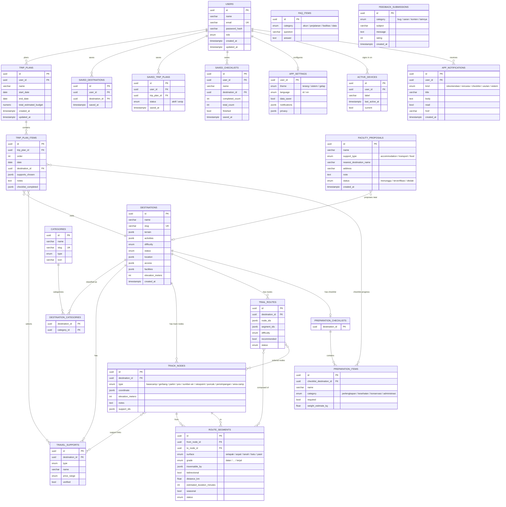
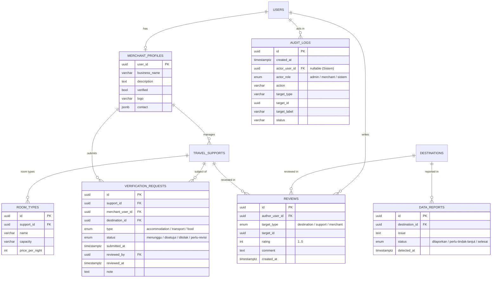
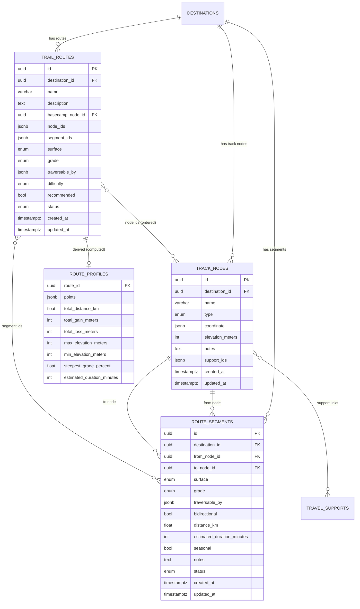

# ERD — Dolenae.id

Rancangan diagram relasi entitas (Entity Relationship Diagram) untuk domain
Dolenae.id — **seluruhnya rancangan**, belum ada tabel/DB.

- **Sumber:** `packages/types/src/*`, `docs/specs/data-model.md`,
  `docs/specs/route-builder.md`, `ADR-0001`, dan layar Figma.
- **Status:** semua entitas **🔜 rancangan** (belum diimplementasi).
- **Render:** Mermaid (didukung GitHub). VS Code perlu ekstensi Markdown
  Preview Mermaid.

---

## 1. ERD Domain Lengkap (rancangan · 🔜)

Pandangan penuh domain sesuai `packages/types`, termasuk yang belum jadi tabel.



Entitas lepas (tanpa relasi): `FAQ_ITEMS`, `FEEDBACK_SUBMISSIONS`.

Entitas AI (`Preference`, `RuleScore`, `RecommendationResult`) **tidak dipersistensi**
— hanya tipe runtime untuk output rekomendasi, jadi tidak digambar sebagai tabel.

---

## 2. Kamus Entitas

| Entitas | Status | Ringkas |
| --- | --- | --- |
| **User** | 🔜 | id, name, email, role (`wisatawan`/`merchant`/`admin`). `Merchant` = User + businessName/description. |
| **Category** | 🔜 | Kategori terkelola admin; `type` = `terrain`/`activity`, `icon` Lucide. |
| **Destination** | 🔜 | Destinasi alam; klasifikasi, geografi (`location`), akses, fasilitas, status `draft`/`published`. |
| **DestinationCategory** | 🔜 | Pivot M:N destinasi ↔ kategori. |
| **TravelSupport** | 🔜 | Pendukung destinasi; diskriminator `accommodation`/`transport`/`food`. |
| **TrackNode** | 🔜 | Titik jalur (basecamp, pos, puncak, …) + elevasi + supportIds. |
| **RouteSegment** | 🔜 | Ruas antar dua node; surface, grade, traversableBy, jarak, durasi. |
| **TrailRoute** | 🔜 | Jalur bernama = rangkaian node/segment (graf, ADR-0001). |
| **PreparationChecklist** | 🔜 | Checklist per destinasi (1:1). |
| **PreparationItem** | 🔜 | Baris item perlengkapan (kategori + required + bobot). |
| **TripPlan** | 🔜 | Rencana perjalanan milik user + budget. |
| **TripPlanItem** | 🔜 | Satu destinasi dalam rencana + support terpilih + progress checklist. |
| **FacilityProposal** | 🔜 | Usulan fasilitas dari merchant/user; status verifikasi. |
| **AppNotification** | 🔜 | Notifikasi in-app (rekomendasi/rencana/checklist/usulan/sistem). |
| **SavedDestination / SavedTripPlan / SavedChecklist** | 🔜 | Item yang disimpan user. |
| **AppSettings / ActiveDevice** | 🔜 | Setelan aplikasi & perangkat aktif. |
| **FaqItem** | 🔜 | Item FAQ (kategori akun/perjalanan/fasilitas/data). |
| **FeedbackSubmission** | 🔜 | Kirim masukan/bug + rating 1–5. |

---

## 3. Relasi Ringkas

```
User 1───* TripPlan
User 1───* SavedDestination / SavedTripPlan / SavedChecklist
User 1───1 AppSettings ;  User 1───* ActiveDevice ;  User 1───* AppNotification

Destination *───* Category            (destination_categories)
Destination 1───* TravelSupport
Destination 1───* TrackNode
Destination 1───* RouteSegment        (fromNodeId/toNodeId → TrackNode)
Destination 1───* TrailRoute          (segmentIds[] / nodeIds[])
TrackNode   1───* RouteSegment
TrackNode   *───* TravelSupport       (supportIds)
Destination 1───1 PreparationChecklist 1───* PreparationItem

TripPlan 1───* TripPlanItem
TripPlanItem *───1 Destination
TripPlanItem *───* TravelSupport      (supportsChosen)
TripPlanItem *───* PreparationItem    (checklistCompleted)

FacilityProposal *───o| Destination   (via nearest name)
```

Konvensi: `ID` = string (uuid/nanoid); tanggal = ISO 8601 / `timestamptz`;
enum sebagai union string literal (TS ↔ Dart ↔ API). Mobile Flutter punya model
Dart tersendiri yang diselaraskan manual dengan `packages/types`.

---

## 4. Cakupan & Kelengkapan

**Entitas:** seluruh `interface`/`type` yang diekspor `packages/types/src/index.ts`
sudah dirancang di sini — **semua berstatus 🔜** (belum ada tabel/DB).

**Sumber entitas route.** `TrackNode`, `RouteSegment`, `TrailRoute` **belum ada
di `packages/types`** — bersumber dari `docs/specs/data-model.md`,
`docs/specs/route-builder.md`, dan `ADR-0001`. Karena itu ditandai 🔜 (rencana).

**Tidak digambar sebagai tabel (memang begitu):**

| Jenis | Contoh | Alasan |
| --- | --- | --- |
| Value object tertanam | `LocationInfo`, `AccessInfo`, `FacilityInfo`, `AccessPoint`, `ContactInfo`, `NotificationPreferences`, `PrivacySettings` | Bagian dari entitas induk (di DB sebagai `jsonb`) |
| View / turunan | `DestinationDetail` (= Destination + supports), `RouteProfile` (turunan) | Dihitung, bukan entitas |
| Runtime AI | `Preference`, `RuleScore`, `RecommendationResult`, `RecommendationContext` | Tidak dipersistensi |
| State UI | `SearchFilter`, `SortOption`, `DifficultyFilter` | State klien |
| Primitif | `ID`, `ISODateString` | Basis tipe |

**Referensi wilayah (bukan tabel DB).** `packages/regions` menyimpan dataset
`province`/`regency`/`district` (nearest-centroid + elevasi) untuk dropdown &
reverse geocode (`ADR-0004`). Dataset ini **mengisi** `Destination.location`,
bukan relasi tabel.

**Foreign key bernuansa inferensi (🔜).** Tipe domain menyimpan sebagian relasi
sebagai objek bersarang, sehingga di diagram ditarik FK eksplisit agar ERD utuh;
FK berikut **belum ada di tipe** dan perlu ditetapkan saat implementasi tabel:

- `SAVED_DESTINATIONS.user_id`, `SAVED_TRIP_PLANS.user_id`,
  `SAVED_CHECKLISTS.user_id` — konteks sesi user, bukan field tipe.
- `APP_NOTIFICATIONS.user_id` — tidak ada di tipe `AppNotification`.
- `TRIP_PLAN_ITEMS.trip_plan_id` — implisit dari `TripPlan.items[]`.
- `PREPARATION_ITEMS.checklist_destination_id` — implisit dari
  `PreparationChecklist.items[]`.

---

## 5. Entitas Back-office & Merchant (inferensi dari Figma)

Entitas di bawah ini **belum ada di `packages/types`/DB** — disimpulkan dari
layar **Figma** (page `Hi-Fi Web` & `Lo-Fi Web`). Status: 🔜. Perlu diangkat ke
`packages/types` saat implementasi.



### Bukti & catatan per entitas

| Entitas | Sumber (Figma) | Catatan |
| --- | --- | --- |
| **MerchantProfile** | Web Admin sidebar "Merchant"; Lo-Fi "Merchant Overview/Profil Bisnis" | `Merchant extends User` sudah ada di types; kini pasti punya status `verified`, statistik layanan, rating. |
| **VerificationRequest (Pengajuan)** | Hi-Fi `Admin - Verifikasi`; Lo-Fi `Merchant - Pengajuan` | Merchant mengajukan **layanan** → admin tinjau (Menunggu/Disetujui/Ditolak/Perlu revisi). Berbeda dari `FacilityProposal` (usulan wisatawan). |
| **RoomType** | Hi-Fi `Admin Fasilitas - Penginapan` | Sub-entitas penginapan: `Kamar Deluxe - kapasitas 2 - Rp350.000`. |
| **Review (Ulasan)** | Lo-Fi `Merchant - Ulasan` (rating 4.8 dari 32); sort "rating" di Jelajah | Ulasan untuk destinasi **dan** layanan; menyimpan agregat rating. |
| **DataReport ("Data dilaporkan")** | Hi-Fi `Admin - Overview` KPI + log "Deteksi data kosong → Dilaporkan" | Temuan otomatis sistem atas data tidak lengkap. |
| **AuditLog** | Hi-Fi `Admin - Overview` tabel aktivitas (Waktu/Aktor/Aktivitas/Target/Status) | Aktor: Admin / Merchant / Sistem. |

### Tambahan field pada entitas lama

- **TravelSupport** — `owner_user_id` (merchant), `verification_status`
  (menunggu/terverifikasi/ditolak/perlu-revisi), `active`, `coordinate`,
  `address`, `distance_from_basecamp`, **`view_count`** (tampilan).
  Lihat `Admin Fasilitas - Penginapan` & `Merchant - Kelola Layanan`.
- **Destination** — `highlights[]` ("Daya tarik utama" di `Create Destinasi -
  Step 1`), `primary_image` (foto utama, maks 6 foto) di Step 5.
- **Category** — sudah sesuai (`Terrain`/`Aktivitas` + jumlah destinasi).

### Menu back-office yang belum ada layarnya

Sidebar mengungkap modul yang di-*reference* tapi **belum digambar**:
- Admin: **Konten**, **Pengguna**, **Pengaturan**.
- Merchant: **Pengajuan**, **Profil Bisnis**, **Ulasan**, **Pengaturan**.

→ Perlu keputusan produk & desain sebelum masuk ERD/implementasi.

---

## 6. Route Builder — Desain Entitas (detail)

> **Hanya desain.** Belum ada tipe di `packages/types`, belum ada tabel/API/UI.
> Sumber: `docs/specs/route-builder.md` + `ADR-0001` + Figma `Hi-Fi Web`
> (Rute & Elevasi). Tidak ada kode di sini — field ditulis sebagai tabel.

### 7.1 Konsep

Jaringan jalur dimodelkan sebagai **graf**: **titik** (node) dihubungkan
**ruas** (segment), lalu dirangkai jadi **jalur** bernama (route). Ruas bisa
dipakai banyak jalur; titik bisa jadi persimpangan. Tiap titik punya elevasi →
**profil elevasi** dapat dihitung. Ini **bukan** navigasi/routing (sesuai batas
produk).

### 7.2 Diagram relasi



### 7.3 Enum

| Enum | Nilai |
| --- | --- |
| **TrackNodeType** | `basecamp`, `gerbang`, `parkir`, `pos`, `sumber-air`, `viewpoint`, `puncak`, `persimpangan`, `area-camp` |
| **RouteSurface** | `setapak`, `aspal`, `tanah`, `batu`, `pasir` (+ `campuran` untuk ringkasan jalur) |
| **RouteGrade** | `datar`, `landai`, `sedang`, `terjal`, `sangat-terjal` |
| **RouteTraversal** | `pejalan-kaki`, `sepeda`, `motor`, `mobil`, `jeep`, `pickup`, `elf`, `minibus`, `ojek`, `open-trip` |
| **RouteStatus** | `draft`, `diterbitkan`, `terverifikasi` |
| **difficulty** | pakai ulang `DestinationCondition`: `ramah-pemula`, `menengah`, `sulit`, `butuh-lokal-guide` |

### 7.4 TrackNode (Titik)

| Field | Tipe | Wajib | Keterangan |
| --- | --- | --- | --- |
| `id` | uuid | ✅ | PK |
| `destinationId` | FK → Destination | ✅ | Pemilik jaringan |
| `name` | string | ✅ | mis. "Cemoro Lawang" |
| `type` | TrackNodeType | ✅ | Jenis titik |
| `coordinate` | { latitude, longitude } | ✅ | Titik peta |
| `elevationMeters` | int | ✅ | Input manual (fase ini) |
| `notes` | text | — | Catatan |
| `supportIds` | uuid[] | — | Tautan `TravelSupport` (biasanya basecamp) |
| `createdAt` / `updatedAt` | timestamptz | ✅ | Audit |

### 7.5 RouteSegment (Ruas)

| Field | Tipe | Wajib | Keterangan |
| --- | --- | --- | --- |
| `id` | uuid | ✅ | PK |
| `destinationId` | FK → Destination | ✅ | Harus sama dengan node |
| `fromNodeId` | FK → TrackNode | ✅ | Titik awal |
| `toNodeId` | FK → TrackNode | ✅ | Titik akhir (≠ from) |
| `surface` | RouteSurface | ✅ | Permukaan |
| `grade` | RouteGrade | ✅ | Kecuraman |
| `traversableBy` | RouteTraversal[] | ✅ | Moda yang boleh lewat |
| `bidirectional` | bool | ✅ | Dua arah / satu arah |
| `distanceKm` | float | — | Auto haversine, bisa ditimpa |
| `estimatedDurationMinutes` | int | — | Estimasi waktu |
| `seasonal` | bool | — | Bisa ditutup pada musim tertentu |
| `notes` | text | — | mis. rawan longsor |
| `status` | RouteStatus | ✅ | Status publikasi |
| `createdAt` / `updatedAt` | timestamptz | ✅ | Audit |

### 7.6 TrailRoute (Jalur)

| Field | Tipe | Wajib | Keterangan |
| --- | --- | --- | --- |
| `id` | uuid | ✅ | PK |
| `destinationId` | FK → Destination | ✅ | Pemilik |
| `name` | string | ✅ | mis. "Trek Kawah" |
| `description` | text | — | Deskripsi jalur |
| `basecampNodeId` | FK → TrackNode | — | Titik awal disarankan |
| `nodeIds` | uuid[] | ✅ | Berurutan (start → end) |
| `segmentIds` | uuid[] | ✅ | Panjang = `nodeIds.length - 1` |
| `surface` | RouteSurface / `campuran` | ✅ | Ringkasan |
| `grade` | RouteGrade | ✅ | Grade dominan/terberat |
| `traversableBy` | RouteTraversal[] | ✅ | Ringkasan |
| `difficulty` | DestinationCondition | ✅ | Diturunkan |
| `recommended` | bool | ✅ | Jalur unggulan |
| `status` | RouteStatus | ✅ | Status publikasi |
| `createdAt` / `updatedAt` | timestamptz | ✅ | Audit |

### 7.7 Turunan — RouteProfile & ElevationPoint (tidak disimpan)

| Entitas | Field | Keterangan |
| --- | --- | --- |
| **RouteProfile** | `routeId`, `points[]`, `totalDistanceKm`, `totalGainMeters`, `totalLossMeters`, `maxElevationMeters`, `minElevationMeters`, `steepestGradePercent`, `estimatedDurationMinutes` | Dihitung dari urutan node/segment |
| **ElevationPoint** | `distanceKm` (kumulatif), `elevationMeters`, `nodeId?`, `name?` | Titik data grafik |

### 7.8 Relasi & kardinalitas

```
Destination 1───* TrackNode
Destination 1───* RouteSegment
Destination 1───* TrailRoute
TrackNode   1───* RouteSegment        (via fromNodeId / toNodeId)
TrailRoute  *───* RouteSegment        (segmentIds, ordered)
TrailRoute  *───* TrackNode           (nodeIds, ordered)
TrackNode   *───* TravelSupport       (supportIds)
TrailRoute  1───1 RouteProfile        (derived, computed)
```

### 7.9 Aturan validasi & rumus (dari spec)

**Validasi**
- Ruas: `fromNodeId ≠ toNodeId`; kedua node milik `destinationId` yang sama;
  tidak boleh ada ruas duplikat untuk pasangan `(from, to)` (arah diabaikan).
- Jalur: setiap pasangan node berurutan **wajib** punya ruas (opsi buat ruas
  otomatis); jalur disarankan mulai dari `basecamp` (peringatan, bukan blokir).
- Peringatan: titik terputus (tak punya ruas); sanity check elevasi vs
  `Destination.elevationMeters`.

**Rumus turunan**
- `distanceKm` ruas = haversine antar koordinat (bisa ditimpa).
- Jarak jalur = Σ `distanceKm` ruas penyusun.
- Gain/loss = Σ selisih elevasi positif/negatif antar node berurutan.
- Grade ruas (%) = `|Δelevasi| / (distanceKm × 1000) × 100`.
- Estimasi waktu = Naismith: `jarakKm/5` jam + `totalGainMeters/600` jam
  (atau Σ `estimatedDurationMinutes` bila semua terisi).
- `difficulty` = dipetakan dari gain total, jarak, dan grade terberat.

### 7.10 Contoh data (Gunung Bromo)

| Titik | Tipe | Elevasi |
| --- | --- | --- |
| Cemoro Lawang | basecamp | 2.200 m |
| Gerbang Penanjakan | gerbang | 2.450 m |
| Penanjakan 1 | viewpoint | 2.770 m |
| Pasir Berbisik | pos | 2.150 m |
| Savana (Teletubbies) | viewpoint | 2.180 m |
| Kawah Bromo | puncak | 2.329 m |
| Pura Luhur Poten | pos | 2.200 m |

Contoh ruas: `Cemoro Lawang → Gerbang Penanjakan` (aspal/sedang),
`Gerbang Penanjakan → Penanjakan 1` (aspal/terjal),
`Cemoro Lawang → Pasir Berbisik` (setapak/landai),
`Pasir Berbisik → Kawah Bromo` (setapak/sedang).
Contoh jalur: **Jeep Sunrise**, **Trek Kawah**, **Savana + Kawah**.

### 7.11 API (rencana) & Figma

| Endpoint | Fungsi |
| --- | --- |
| `GET /destinations/:id/routes` | Daftar jalur destinasi |
| `GET /routes/:id` | Detail jalur + node/segment |
| `GET /routes/:id/profile` | `RouteProfile` (grafik elevasi) |
| `GET /track-nodes?destinationId=` | Daftar titik |
| `GET /segments?destinationId=` | Daftar ruas |
| `POST/PATCH/DELETE /track-nodes`, `/segments`, `/routes` | Editor (admin) |

Figma: `Admin - Rute & Elevasi - Preview`, `Admin - Rute & Elevasi - Peta
Fullscreen`, + 6 menu konteks peta (`Hi-Fi Web`, deret `x=18300`).

### 7.12 Status

🔜 **Desain selesai; implementasi belum.** Yang belum: tipe di
`packages/types/src/route.ts`, seed, endpoint, dan UI admin/publik. Keputusan
yang masih terbuka: siapa boleh mengedit (admin saja / merchant juga?), dan
cakupan tampilan publik (hanya grafik + daftar, atau lebih).
